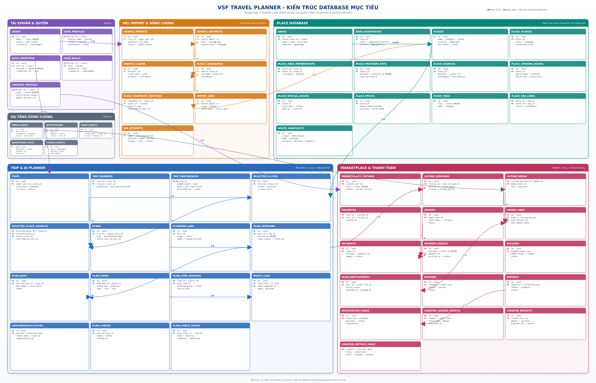

# Kiến trúc cơ sở dữ liệu

> Trạng thái: thiết kế mục tiêu cho MVP, chưa phải schema đã được migration đầy
> đủ. Repository hiện chỉ lưu bền vững bảng `users`; plan vẫn đang ở bộ nhớ.

## 1. Mục tiêu

Database phải hỗ trợ trọn vẹn hai hành trình của MVP:

1. URL video/nội dung -> claim có bằng chứng -> địa điểm được xác nhận -> Main
   Plan -> CheckOverall -> Backup Plan -> chỉnh sửa và sử dụng.
2. Creator publish một plan version -> buyer thanh toán -> entitlement -> bản sao
   cá nhân -> tiếp tục chỉnh sửa bằng Planner.

Thiết kế dùng PostgreSQL làm nguồn dữ liệu chính, PostGIS cho địa lý, object
storage cho media/artifact lớn và background worker cho import/generate/payment.



[Mở ảnh ERD kích thước đầy đủ](assets/database-architecture-erd.png)

## 2. Đánh giá ERD Place Database ban đầu

### Điểm tốt

- `areas` tự tham chiếu phù hợp cấu trúc quốc gia, tỉnh/thành, quận và khu vực.
- `places` tách khỏi giờ mở cửa, ngày đặc biệt, giá và nguồn, tránh lặp dữ liệu.
- `place_sources` giữ provider, external ID, thời điểm lấy và confidence.
- Giờ thường và giờ đặc biệt được tách riêng, đúng với dữ liệu vận hành.
- Có ý tưởng aggregate khu vực để Planner hiểu “khu vực này phù hợp trải nghiệm
  gì” thay vì chỉ tìm từng địa điểm.

### Phần cần chỉnh

- `latitude/longitude` dạng decimal khó query bán kính và route; nên dùng
  `geography(Point, 4326)` với spatial index.
- `tags text[]`, `place_type varchar` và `status varchar` dễ phát sinh taxonomy
  không nhất quán; tag cần bảng chuẩn hóa, type/status cần enum hoặc check.
- Các trường thống kê JSONB trong `areas` là dữ liệu dẫn xuất. Ghi trực tiếp vào
  `areas` làm mất lịch sử và khó biết độ mới; chuyển sang `area_aggregates`.
- `amount_min/amount_max` dạng decimal không phù hợp quy tắc tiền; dùng `bigint`
  theo đơn vị nhỏ nhất và `char(3)` cho currency.
- Giờ mở cửa cần hỗ trợ nhiều khoảng trong một ngày và đóng sau nửa đêm.
- `raw_data jsonb` trong `place_sources` có thể lớn hoặc vi phạm điều khoản lưu
  trữ; chỉ giữ snapshot cần thiết, hash và object-storage key.
- `user_saved_places` chỉ trả lời “user đã lưu place nào”, chưa trả lời place đó
  thuộc trip nào, đến từ URL/claim nào, có bắt buộc hay chưa. Planner cần
  `selected_places` và `selected_place_sources`.
- ERD chưa có import pipeline, plan version, route, check, backup, Marketplace,
  payment, entitlement, moderation và audit.

Kết luận: ERD ban đầu là nền tốt cho bounded context `places`, nhưng không nên
dùng nó làm toàn bộ database của sản phẩm.

## 3. Nguyên tắc thiết kế

- Dùng `uuid` cho ID nghiệp vụ. Ưu tiên UUID v7 do ứng dụng tạo; API vẫn coi ID
  là chuỗi opaque.
- Tất cả thời điểm dùng `timestamptz`; ngày/giờ lịch trình giữ thêm timezone và
  local date/time.
- Tiền dùng `bigint amount_minor` và mã ISO `char(3)`, không dùng float/decimal.
- JSONB chỉ dành cho metadata linh hoạt, evidence, rule configuration và snapshot
  nhỏ; quan hệ cốt lõi phải có bảng/FK.
- Nội dung lớn như video, transcript đầy đủ, ảnh và raw provider payload nằm ở
  object storage; database giữ key, hash, content type và retention policy.
- Plan/listing version đã publish hoặc đã bán là bất biến.
- Mỗi dữ liệu bên ngoài phải có provider/source, `retrieved_at`,
  `last_verified_at` hoặc confidence phù hợp.
- Xóa mềm áp dụng cho nội dung người dùng. Order, payment, entitlement, ledger và
  audit không bị hard delete theo yêu cầu thông thường.
- Các trạng thái phải dùng PostgreSQL enum hoặc `check constraint`; payload API
  không được cập nhật trạng thái tùy ý.

## 4. Các nhóm bảng

### 4.1. Tài khoản và phân quyền

| Bảng | Tác dụng |
| --- | --- |
| `users` | Danh tính tài khoản, email, trạng thái và timestamp. Không dùng một cột role để quyết định toàn bộ quyền. |
| `user_profiles` | Tên hiển thị, avatar, locale, timezone và tùy chọn du lịch mặc định. |
| `auth_identities` | Liên kết user với email/password hoặc OAuth provider; unique theo `(provider, provider_subject)`. |
| `user_roles` | Gán quyền nền tảng như traveler, creator, operator hoặc admin; PK kép `(user_id, role)`. |
| `creator_profiles` | Slug, bio, trạng thái xác minh và tham chiếu tài khoản payout của creator. |

`creator_profiles` là capability bổ sung của `users`, không phải một loại user
tách biệt. Quyền trong từng trip vẫn do `trip_members` quyết định.

### 4.2. Import URL và bằng chứng

| Bảng | Tác dụng |
| --- | --- |
| `source_imports` | Một URL được user đưa vào trip; lưu platform, URL hash, trạng thái quyền truy cập và trạng thái import. |
| `source_artifacts` | Metadata, caption, transcript hoặc frame reference được phép dùng; nội dung lớn lưu ngoài DB. |
| `source_claims` | Claim được trích xuất như place, activity, timing, price hoặc advice; có evidence và confidence. |
| `place_candidates` | Tên/khu vực địa điểm thô được tạo từ một claim. |
| `place_candidate_matches` | Các place có thể khớp với candidate, score/rank và lựa chọn xác nhận của user. |
| `import_jobs` | Tiến độ `fetching -> extracting -> resolving -> needs_review`, lỗi và retry của một import. |
| `job_attempts` | Lịch sử từng lần gọi connector/model/provider, độ trễ, mã lỗi và chi phí; không lưu prompt/payload nhạy cảm. |

Chuỗi provenance không được đứt:

```text
source_imports
-> source_artifacts
-> source_claims
-> place_candidates
-> place_candidate_matches
-> places
-> selected_places
```

Candidate chưa được xác nhận không được coi là yêu cầu của user.

### 4.3. Danh mục địa điểm

| Bảng | Tác dụng |
| --- | --- |
| `areas` | Cây khu vực dùng chung cho mọi thành phố; hỗ trợ `parent_area_id`, type, slug và centroid. |
| `area_aggregates` | Snapshot thống kê/experience profile do job tổng hợp; có version và `aggregated_at`. |
| `places` | Danh tính địa điểm chuẩn hóa, tọa độ PostGIS, category, trạng thái, thời lượng gợi ý và thuộc tính Planner. |
| `place_aliases` | Tên khác, tên địa phương và tên được trích xuất để tìm kiếm/dedup. |
| `place_area_memberships` | Quan hệ nhiều-nhiều giữa place và area, có cờ `is_primary`. |
| `place_provider_refs` | Ánh xạ place nội bộ với `(provider, external_id)` duy nhất. |
| `place_sources` | Snapshot nguồn đã dùng để xác minh place, freshness, confidence và object key của payload khi được phép. |
| `place_opening_hours` | Các khoảng mở cửa thường theo thứ trong tuần, giai đoạn hiệu lực và hỗ trợ đóng qua ngày hôm sau. |
| `place_special_hours` | Giờ đóng/mở ngoại lệ theo ngày cụ thể như lễ, bảo trì hoặc sự kiện. |
| `place_prices` | Khoảng giá theo price type, customer type, currency, unit và thời hạn hiệu lực. |
| `place_tags` | Taxonomy tag chuẩn hóa để tìm kiếm, thống kê và Planner dùng ổn định. |
| `place_tag_links` | Quan hệ nhiều-nhiều place–tag, có source/confidence. |
| `route_snapshots` | Cache kết quả định tuyến có provider, profile, geometry, khoảng cách, thời lượng và `fetched_at`. |

`areas` trả lời “khu vực nào phù hợp trải nghiệm gì”; `places` trả lời “cụ thể
nên đi đâu”. Aggregate chỉ là dữ liệu dẫn xuất và có thể xây lại.

### 4.4. Trip và Planner

| Bảng | Tác dụng |
| --- | --- |
| `trips` | Aggregate gốc của chuyến đi: owner, tên, ngày đi, timezone, currency, trạng thái và khu vực đích. |
| `trip_members` | Thành viên và quyền host/editor/viewer; PK kép `(trip_id, user_id)`. |
| `trip_preferences` | Ngân sách, pace, group profile, accessibility, transport và hard/soft constraints của trip. |
| `selected_places` | Place đã được user xác nhận cho trip, priority, intent, must-visit và ghi chú. |
| `selected_place_sources` | Nối một selected place với nhiều claim/URL, giữ đầy đủ provenance sau dedup. |
| `plans` | Một phương án plan thuộc trip; phân biệt main, backup và personal copy; có `parent_plan_id` hoặc source version. |
| `planning_jobs` | Một lần chạy Explorer/Planner/Finder/Check, model/schema version, stage, token/cost và trạng thái. |
| `plan_versions` | Snapshot bất biến của plan; unique `(plan_id, version_no)`, dùng để publish, mua và khôi phục. |
| `plan_days` | Ngày/thứ tự/chủ đề/khu vực của một plan version; unique `(plan_version_id, day_number)`. |
| `plan_items` | Item theo thứ tự, stable key, place, local time, duration, lock, chi phí và trạng thái hoàn thành. |
| `plan_item_sources` | Nối item với selected place, claim hoặc nguồn đề xuất của hệ thống để giải thích nguồn gốc. |
| `route_legs` | Chặng giữa hai item, mode, route snapshot và dữ liệu override được user chấp nhận. |
| `unscheduled_places` | Place đã xác nhận nhưng không thể xếp, reason code, issue và đề xuất xử lý. |
| `plan_checks` | Một lần kiểm tra schema/domain/provider/safety cho plan version. |
| `plan_check_issues` | Issue có code, severity, item liên quan, evidence, khả năng auto-fix và trạng thái xử lý. |

Quy tắc quan trọng:

- Backup có `parent_plan_id` trỏ Main Plan và không được thay đổi version của
  Main Plan.
- Buyer copy có `source_plan_version_id`, nhưng lifecycle/version riêng.
- Mọi `selected_places` phải xuất hiện trong `plan_items` hoặc
  `unscheduled_places`.
- AI revision tạo version mới và giữ item có `is_locked = true`.

### 4.5. Marketplace và thanh toán

| Bảng | Tác dụng |
| --- | --- |
| `marketplace_listings` | Aggregate listing do creator sở hữu, slug và trạng thái lifecycle. |
| `listing_versions` | Snapshot bất biến của title, description, price, license, preview policy và `plan_version_id`. |
| `listing_media` | Thứ tự/role của media asset trong từng listing version. |
| `favorites` | Buyer lưu listing; PK kép `(user_id, listing_id)`. |
| `orders` | Đơn hàng của buyer với tổng tiền snapshot và trạng thái. |
| `order_lines` | Listing version/plan version thực tế đã mua cùng giá tại thời điểm checkout. |
| `payments` | Payment intent/charge phía provider, amount/currency và trạng thái đã xác minh. |
| `payment_events` | Webhook event duy nhất theo `(provider, provider_event_id)` để xử lý idempotent. |
| `refunds` | Hoàn tiền toàn phần/một phần, lý do, provider reference và người phê duyệt. |
| `plan_entitlements` | Quyền truy cập được cấp từ order line; unique theo user và order line. |
| `reviews` | Đánh giá gắn buyer và order line đã xác minh; một review cho mỗi giao dịch đủ điều kiện. |
| `reports` | Báo cáo listing/version, reason, evidence và trạng thái xử lý. |
| `moderation_cases` | Hồ sơ điều tra kết hợp report, quyết định, assignee và audit trail. |
| `creator_ledger_entries` | Sổ cái append-only cho sale, fee, refund, adjustment và payout. |
| `creator_payouts` | Yêu cầu/chuyến payout tới creator, tổng tiền và provider status. |
| `creator_metrics_daily` | Dữ liệu tổng hợp theo ngày cho view, conversion, sale, refund và revenue. |

`order_lines` phải trỏ trực tiếp tới cả `listing_versions` và `plan_versions`.
Không suy ra phiên bản đã mua từ “version hiện tại” của listing.

### 4.6. Hạ tầng dùng chung

| Bảng | Tác dụng |
| --- | --- |
| `media_assets` | Metadata file trong object storage, owner, checksum, scan/moderation status và quyền truy cập. |
| `notifications` | Thông báo cho user với channel, template, payload nhỏ và trạng thái gửi/đọc. |
| `audit_events` | Nhật ký append-only cho hành động nhạy cảm, actor, target, request ID và diff đã loại PII. |
| `idempotency_keys` | Bảo vệ create plan, checkout, refund và thao tác retry khỏi tạo dữ liệu trùng. |
| `outbox_events` | Transactional outbox để phát job/webhook/notification sau khi transaction nghiệp vụ commit. |

## 5. Quan hệ và bất biến bắt buộc

| Quy tắc | Cách bảo vệ |
| --- | --- |
| Một provider place không map vào hai place nội bộ | Unique `(provider, external_id)` trên `place_provider_refs` |
| Một selected place không lặp trong cùng trip | Unique `(trip_id, place_id)` |
| Mọi bản version có thứ tự ổn định | Unique `(plan_id, version_no)`, `(plan_version_id, day_number)`, `(plan_day_id, position)` |
| Backup không tự làm cha của chính nó | Check `parent_plan_id <> id`; domain validator kiểm tra parent là main |
| Publish chỉ dùng plan đã check | Service transaction kiểm tra `plan_versions.check_status = passed` |
| Buyer chỉ nhận đúng bản đã mua | `order_lines` FK tới version; entitlement FK tới order line |
| Webhook không xử lý hai lần | Unique provider event ID + transaction + outbox |
| Review phải từ giao dịch hợp lệ | Unique `(reviewer_user_id, order_line_id)` và service kiểm tra entitlement |
| Ledger không bị sửa lịch sử | Chỉ insert reversal entry; cấm update/delete ở quyền ứng dụng |
| Main Plan không bị Backup mutate | Version bất biến và backup nằm ở row `plans` riêng |

Những bất biến phụ thuộc nhiều aggregate nên được kiểm tra trong domain service
và transaction; không cố nhồi toàn bộ vào trigger khó kiểm thử.

## 6. Index đề xuất

- GIST trên `places.location`; B-tree trên `places.status/category`.
- Trigram/FTS index trên `places.name`, `place_aliases.alias` và listing search
  document.
- B-tree trên mọi FK có truy vấn ngược thường xuyên.
- Partial index cho import/job đang chạy, listing published, entitlement active,
  notification chưa đọc và outbox chưa publish.
- Unique index không phân biệt hoa thường cho email/slug.
- Composite index:
  `(trip_id, status)`, `(plan_id, version_no desc)`,
  `(plan_version_id, day_number)`, `(listing_id, version_no desc)`,
  `(buyer_user_id, created_at desc)`, `(creator_user_id, metric_date)`.
- GIN chỉ dùng cho JSONB thực sự được query; không index toàn bộ raw metadata.

Khi bảng `audit_events`, `payment_events`, `outbox_events` hoặc
`creator_metrics_daily` lớn, partition theo tháng. Place/plan/order chưa cần
partition trong MVP.

## 7. Transaction quan trọng

### Xác nhận place

Trong một transaction: khóa candidate -> tạo/cập nhật place match -> tạo
`selected_places` -> thêm `selected_place_sources` -> ghi audit event. Retry phải
dùng idempotency key.

### Publish listing

Kiểm tra plan version đã pass -> đóng băng plan version -> tạo listing version ->
gắn media/preview -> chuyển listing sang published -> ghi outbox/audit.

### Payment và entitlement

Khóa payment event -> xác minh signature, amount và currency -> cập nhật payment
và order -> tạo entitlement một lần -> ghi ledger -> tạo outbox. Không gọi
provider bên ngoài bên trong transaction đang giữ row lock.

### Tạo bản sao cho buyer

Kiểm tra entitlement -> tạo `trips/plans` mới -> clone từ đúng
`source_plan_version_id` -> ghi provenance -> commit. Không copy listing theo
version hiện tại.

## 8. Bảo mật, lưu giữ và quyền riêng tư

- URL riêng tư nên mã hóa ở mức ứng dụng hoặc lưu object bảo vệ; dùng URL hash
  cho dedup và tuyệt đối không ghi URL đầy đủ vào log.
- Chỉ lưu evidence ngắn cần thiết. Artifact/raw payload có expiry theo quyền và
  điều khoản nguồn.
- Payment không chứa dữ liệu thẻ thô; chỉ lưu provider token/reference.
- Payout account reference và dữ liệu xác minh creator được mã hóa, giới hạn
  quyền truy cập.
- Plan/trip mặc định riêng tư. Có thể áp dụng PostgreSQL RLS như lớp phòng vệ bổ
  sung sau khi authorization ở service đã ổn định.
- Hard delete user phải tách PII khỏi hồ sơ tài chính bắt buộc lưu; dùng
  anonymization thay vì xóa order/ledger/audit.

## 9. Lộ trình migration

Hiện tại `users.id` là integer. Không nên tạo hàng chục FK mới rồi mới đổi kiểu
khóa. Trình tự đề xuất:

1. Chốt UUID hay bigint trước migration domain đầu tiên. Thiết kế này khuyến nghị
   UUID và đổi `users` ở giai đoạn nền tảng khi dữ liệu còn ít.
2. Tạo extensions cần thiết: `pgcrypto`, `citext`, `postgis`, tùy chọn
   `pg_trgm`.
3. Tạo identity, area/place và import tables.
4. Tạo trip/planner/version/check tables và chuyển repository plan khỏi memory.
5. Tạo Marketplace/order/payment/entitlement/ledger tables.
6. Tạo platform tables, index, retention job và backup/restore test.
7. Mỗi migration phải có test upgrade; migration dữ liệu lớn cần chiến lược
   expand/backfill/contract.

Không triển khai toàn bộ schema trong một migration. Mỗi bounded context có
migration nhỏ, rollback/forward-fix rõ ràng và được repository tương ứng sở hữu.

## 10. Quyết định cần ADR trước khi code

- UUID v7 do app tạo hay UUID v4/PostgreSQL tạo.
- Place/map provider và quyền cache payload/geometry.
- Connector video ưu tiên và chính sách lưu caption/transcript/frame.
- Payment provider, mô hình merchant/payout và yêu cầu lưu hồ sơ tài chính.
- Phạm vi sử dụng PostGIS và chiến lược tìm kiếm PostgreSQL trước khi cân nhắc
  search engine riêng.

Thiết kế này là chuẩn đích để chia migration và repository; tên field cuối cùng
phải được kiểm tra cùng API schema trước khi triển khai.
